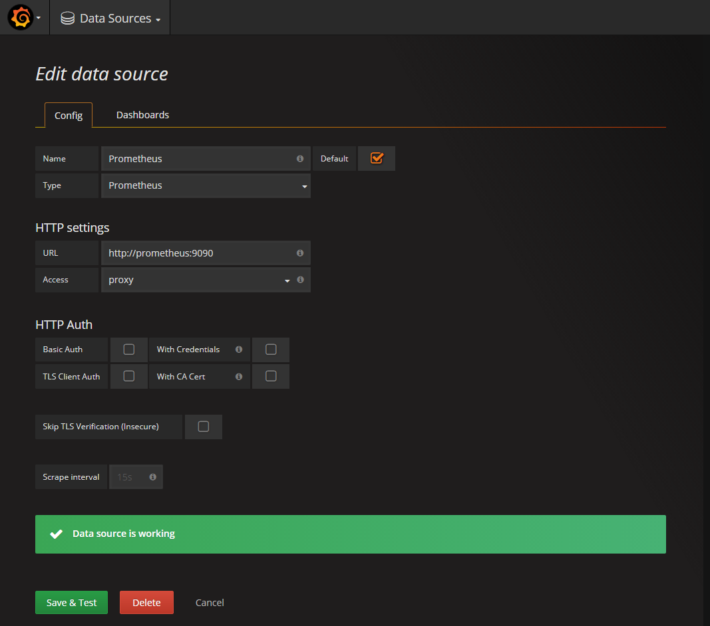

# Contents

- Introduction
  - [Overview](#a-prometheus--grafana-docker-compose-stack)
  - [Pre-requisites](#pre-requisites)
  - [Installation & Configuration](#installation--configuration)
  	- [Post Configuration](#post-configuration)
        - [Datasource Configuration](#datasource-configuration)
        - [Ping Configuration](#ping-configuration)
        - [Alert Configuration](#alert-configuration)
    - [Dashboards](#dashboards)
  	- [Utility Scripts](#utility-scripts)
  	- [Test Alerts](#test-alerts)
  - [Security Considerations](#security-considerations)
  	- [Production Security](#production-security)
  - [Troubleshooting](#troubleshooting)
  	- [Mac Users](#mac-users)

# A Prometheus & Grafana docker-compose stack

Here's a quick start to stand-up a [Prometheus](http://prometheus.io/) stack containing Prometheus, Grafana and to monitor website uptime.

# Pre-requisites
Before we get started installing the Prometheus stack. Ensure you install the latest version of docker and [docker swarm](https://docs.docker.com/engine/swarm/swarm-tutorial/) on your Docker host machine. Docker Swarm is installed automatically when using Docker for Mac or Docker for Windows.

# Installation & Configuration

    $ curl https://raw.githubusercontent.com/PagerTree/prometheus-grafana-alertmanager-example/master/install.sh | sudo sh

At this point you'll have automagically deployed the entire Grafana and Prometheus stack. You can now access the Grafana dashboard at `http://<Host IP Address>:3000`. *Note: before the dashboards will work you need to follow the [Datasource Configuration section](#datasource-configuration).*

Here's a list of all the services that are created:

| Service | Port | Description | Notes |
| --- |:---:| --- | --- |
| Prometheus | :9090 | Data Aggregator | |
| Alert Manager | :9093 | Adds Alerting for Prometheus Checks | |
| Grafana | :3000 | UI To Show Prometheus Data | Username: `admin`, Password: `9uT46ZKE`|
| Node Exporter | :9100 | Data Collector for Computer Stats | |
| CA Advisor | :8080 | Collect resource usage of the Docker container | |
| Blackbox Exporter | :9115 | Data Collector for Ping & Uptime | | |

## Post Configuration

### Datasource Configuration
Now we need to create the Prometheus Datasource in order to connect Grafana to Prometheus
* Click the `Grafana` Menu at the top left corner (looks like a fireball)
* Click `Data Sources`
* Click the green button `Add Data Source`.
* Input the following parameters **exactly as shown**
    * Name - `Prometheus`, Default - `checked`
    * Type - `Prometheus`
    * HTTP settings
        * URL - `http://prometheus:9090`
        * Access - `proxy`
* Click `Save & Test`



### Ping Configuration

If you would like to add or change the Ping targets should be monitored you'll want to edit the `targets` section in [prometheus/prometheus.yml](prometheus/prometheus.yml)

```yml
...

- job_name: 'blackbox'
  metrics_path: /probe
  params:
    module: [http_2xx]
  static_configs:
    - targets:
      - https://pagertree.com # edit here
      - https://google.com # edit here

...
```

If you made changes to the Prometheus config you'll want to reload the configuration using the following command:

    $ curl -X POST http://<Host IP Address>:9090/-/reload

### Alert Configuration
You'll want to edit the Webhook configuration in [alertmanager/config.yml](alertmanager/config.yml) to hook up to PagerTree.

```yml
...
receivers:
    - name: 'pager'
      webhook_configs:
      - url: <PagerTree WebHook URL> # replace with your PagerTree webhook url
...
```

If you made changes to the AlertManager config you'll want to reload the configuration using the following command:

    $ curl -X POST http://<Host IP Address>:9093/-/reload

## Dashboards

Included are a couple of dashboards

You can always find more dashboards on the [Grafana Dashboards Page](https://grafana.com/dashboards?dataSource=prometheus).

## Utility Scripts

We've provided some utility scripts in the `util` folder.

| Script | Args | Description | Example |
| --- |:---:| --- | --- |
| docker-log.sh | service | List the logs of a docker service by name | ./util/docker-log.sh grafana |
| docker-ssh.sh | service | SSH into a service container | ./util/docker-ssh.sh grafana |
| high-load.sh | | Simulate high CPU load on the current computer | ./util/high-load.sh |
| restart.sh | | Restart all services | ./util/restart.sh |
| start.sh | | Start all services | ./util/start.sh |
| status.sh | | Print status all services | ./util/status.sh |
| stop.sh | | Stop all services | ./util/stop.sh |

## Alerting
Alerting has been added to the stack with Slack integration. 2 Alerts have been added and are managed

Alerts              - `prometheus/alert.rules`
PagerTree Webhook configuration - `alertmanager/config.yml`

The PagerTree configuration requires to create a Prometheus Integration. Follow steps 1-6 [here](https://pagertree.com/knowledge-base/integration-prometheus/#in-pagertree) then replace `<PagerTree WebHook URL>` in [/alertmanager/config.yml](/alertmanager/config.yml) with your copied webhook.

View Prometheus alerts `http://<Host IP Address>:9090/alerts`
View Alert Manager `http://<Host IP Address>:9093`

### Test Alerts
A quick test for your alerts is to stop a service. Stop the node_exporter container and you should notice shortly the alert arrive in Slack. Also check the alerts in both the Alert Manager and Prometheus Alerts just to understand how they flow through the system.

High load test alert - `./util/high-load.sh`

Let this run for a few minutes and you will notice the load alert appear. Then Ctrl+C to stop this command.

## Install Dashboard
I created a Dashboard template which is available on [Grafana Docker Dashboard](https://grafana.net/dashboards/179). Simply download the dashboard and select from the Grafana menu -> Dashboards -> Import

This dashboard is intended to help you get started with monitoring. If you have any changes you would like to see in the Dashboard let me know so I can update Grafana site as well.

Here's the Dashboard Template


Grafana Dashboard - `dashboards/Grana_Dashboad.json`
Alerting Dashboard - `dashboards/System_Monitoring.json`

# Security Considerations
This project is intended to be a quick-start to get up and running with Docker and Prometheus. Security has not been implemented in this project. It is the users responsibility to implement Firewall/IpTables and SSL.

Since this is a template to get started Prometheus and Alerting services are exposing their ports to allow for easy troubleshooting and understanding of how the stack works.

## Production Security:
Here are just a couple security considerations for this stack to help you get started.
* Remove the published ports from Prometheus and Alerting services and only allow Grafana to be accessed
* Enable SSL for Grafana with a Proxy such as [jwilder/nginx-proxy](https://hub.docker.com/r/jwilder/nginx-proxy/) or [Traefik](https://traefik.io/) with Let's Encrypt
* Add user authentication via a Reverse Proxy [jwilder/nginx-proxy](https://hub.docker.com/r/jwilder/nginx-proxy/) or [Traefik](https://traefik.io/) for services cAdvisor, Prometheus, & Alerting as they don't support user authenticaiton
* Terminate all services/containers via HTTPS/SSL/TLS

# Troubleshooting
It appears some people have reported no data appearing in Grafana. If this is happening to you be sure to check the time range being queried within Grafana to ensure it is using Today's date with current time.

## Mac Users
Node-Exporter is not designed to run on Mac and in fact cannot collect metrics from the Mac OS. I recommend you comment out the node-exporter section in the [docker-compose.yml](docker-compose.yml) file and instead just use the cAdvisor.
