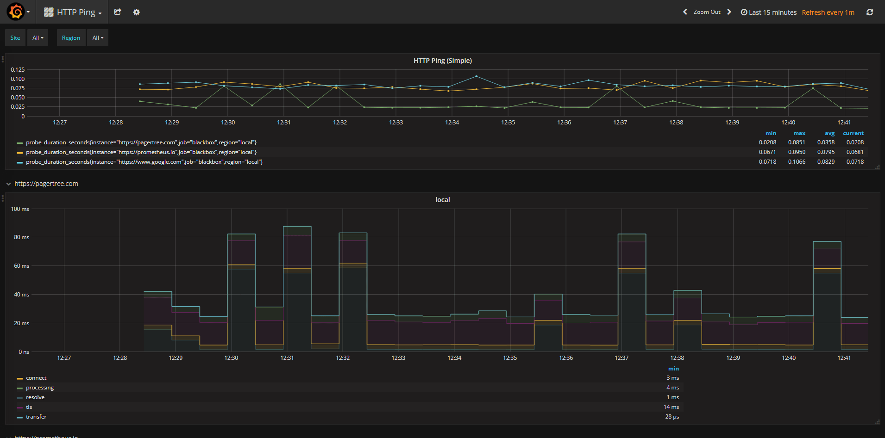
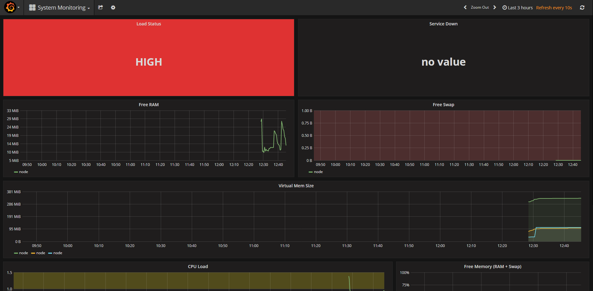

# Contents

* [Overview](#a-prometheus--grafana-docker-compose-stack)
* [Pre-requisites](#pre-requisites)
* [Installation & Configuration](#installation--configuration)
   * [Post Configuration](#post-configuration)
      * [Datasource Configuration](#datasource-configuration)
      * [Ping Configuration](#ping-configuration)
      * [Alert Configuration](#alert-configuration)
* [Dashboards](#dashboards)
    * [Ping Dashboard](#ping-dashboard)
    * [System Monitoring Dashboard](#system-monitoring-dashboard)
* [Test Alerts](#test-alerts)
* [Utility Scripts](#utility-scripts)
* [Security Considerations](#security-considerations)
   * [Production Security](#production-security)
* [Troubleshooting](#troubleshooting)
   * [Mac Users](#mac-users)

# A Prometheus & Grafana docker-compose stack

Here's a quick start to stand-up a [Prometheus](http://prometheus.io/) stack containing Prometheus, [Grafana](https://grafana.com/) and to monitor website uptime.

Here are links to the [blog](https://pagertree.com/2017/12/01/prometheus-tutorial/) and [video](https://youtu.be/-STqqJZG36w) tutorials so you can follow along.

# Pre-requisites

This tutorial assumes you are running on a Ubuntu 16.04 server. I like using [this](https://www.digitalocean.com/products/one-click-apps/docker/) Digital Ocean image. You can also use your own service provider.

Once you have your Ubuntu node ready, go to the [Installation & Configuration](#installation--configuration) section below.

## Digital Ocean Setup (Optional)

If you already have a [Digital Ocean](https://www.digitalocean.com/) account, you can click [here](https://cloud.digitalocean.com/droplets/new?image=docker) to create a new droplet.

If you don't already have a [Digital Ocean](https://www.digitalocean.com/) account, create one using [this link](https://m.do.co/c/ab4304b8ca5a) to create an account and get **$10 in credits** when you create your account.

For this demo the smallest standard droplet will do. If you don't know how to create a droplet or how to SSH into it you can follow my  [demo on Medium](https://medium.com/@armiiller/create-a-docker-droplet-on-digital-ocean-f19db2b4be53).

# Installation & Configuration
For a one click install experience run the following command:
```curl
curl https://raw.githubusercontent.com/PagerTree/prometheus-grafana-alertmanager-example/master/install.sh -H 'Cache-Control: no-cache' | sudo sh
```

At this point you'll have automagically deployed the entire Grafana and Prometheus stack. You can now access the Grafana dashboard at `http://<Host IP Address>:3000` *Username: `admin`, Password: `9uT46ZKE`*. *Note: before the dashboards will work you need to follow the [Datasource Configuration section](#datasource-configuration).*

Here's a list of all the services that are created:

| Service | Port | Description | Notes |
| --- |:---:| --- | --- |
| Prometheus | :9090 | Data Aggregator | |
| Alert Manager | :9093 | Adds Alerting for Prometheus Checks | |
| Grafana | :3000 | UI To Show Prometheus Data | Username: `admin`, Password: `9uT46ZKE`|
| Node Exporter | :9100 | Data Collector for Computer Stats | |
| CA Advisor | :8080 | Collect resource usage of the Docker container | |
| Blackbox Exporter | :9115 | Data Collector for Ping & Uptime | | |

## Post Configuration

### Ping Configuration

If you would like to add or change the Ping targets should be monitored you'll want to edit the `targets` section in [prometheus/prometheus.yml](prometheus/prometheus.yml)

```yml
...

- job_name: 'blackbox'
  metrics_path: /probe
  params:
    module: [http_2xx]
  static_configs:
    - targets:
      - https://pagertree.com # edit here
      - https://google.com # edit here

...
```

If you made changes to the Prometheus config you'll want to reload the configuration using the following command:

```curl
curl -X POST http://<Host IP Address>:9090/-/reload
```

### Alert Configuration
The [PagerTree](https://pagertree.com) configuration requires to create a Prometheus Integration. Follow steps 1-6 [here](https://pagertree.com/knowledge-base/integration-prometheus/#in-pagertree) then replace `https://ngrok.io` in [/alertmanager/config.yml](/alertmanager/config.yml) with your copied webhook.

```yml
...
receivers:
    - name: 'pager'
      webhook_configs:
      - url: https://ngrok.io # replace with your PagerTree webhook url
...
```

If you made changes to the AlertManager config you'll want to reload the configuration using the following command:

```curl
curl -X POST http://<Host IP Address>:9093/-/reload
```

## Dashboards

Included are two dashboards. You can always find more dashboards on the [Grafana Dashboards Page](https://grafana.com/dashboards?dataSource=prometheus).

### Ping Dashboard

Shows HTTP uptime from websites monitored. See [Ping Configuration](ping-configuration) section.



### System Monitoring Dashboard

Shows stats like RAM, CPU, Storage of the current node.



## Utility Scripts

We've provided some utility scripts in the `util` folder.

| Script | Args | Description | Example |
| --- |:---:| --- | --- |
| docker-log.sh | service | List the logs of a docker service by name | ./util/docker-log.sh grafana |
| docker-nuke.sh | service | Removes docker services and volumes created by this project | ./util/docker-nuke.sh |
| docker-ssh.sh | service | SSH into a service container | ./util/docker-ssh.sh grafana |
| high-load.sh | | Simulate high CPU load on the current computer | ./util/high-load.sh |
| restart.sh | | Restart all services | ./util/restart.sh |
| start.sh | | Start all services | ./util/start.sh |
| status.sh | | Print status all services | ./util/status.sh |
| stop.sh | | Stop all services | ./util/stop.sh |

## Alerting

There are 3 basic alerts that have been added to this stack.

| Alert | Time To Fire | Description |
| --- | :---: | --- |
| Site Down | 30 seconds | Fires if a website check is down |
| Service Down | 30 seconds | Fires if a service in this setup is down |
| High Load | 30 seconds | Fires if the CPU load is greater than 50% |

To get alerts sent to you, follow the directions in the [Alert Configuration Section](#alert-configuration).

### Test Alerts
A quick test for your alerts is to simulate high CPU load. Run the utility script `./util/high-load.sh` and about 30 seconds or so later you should notice the incident created in [PagerTree](https://pagertree.com) (assuming you followed the [Alert Configuration Section](#alert-configuration) and you'll also get notifications.

Then `Ctrl+C` to stop this command. The incident should auto resolve in PagerTree.

# Security Considerations
This project is intended to be a quick-start to get up and running with Docker and Prometheus. Security has not been implemented in this project. It is the users responsibility to implement Firewall/IpTables and SSL.

Since this is a template to get started Prometheus and Alerting services are exposing their ports to allow for easy troubleshooting and understanding of how the stack works.

## Production Security:
Here are just a couple security considerations for this stack to help you get started.
* Remove the published ports from Prometheus and Alerting services and only allow Grafana to be accessed
* Enable SSL for Grafana with a Proxy such as [jwilder/nginx-proxy](https://hub.docker.com/r/jwilder/nginx-proxy/) or [Traefik](https://traefik.io/) with Let's Encrypt
* Add user authentication via a Reverse Proxy [jwilder/nginx-proxy](https://hub.docker.com/r/jwilder/nginx-proxy/) or [Traefik](https://traefik.io/) for services cAdvisor, Prometheus, & Alerting as they don't support user authenticaiton
* Terminate all services/containers via HTTPS/SSL/TLS

# Troubleshooting
It appears some people have reported no data appearing in Grafana. If this is happening to you be sure to check the time range being queried within Grafana to ensure it is using Today's date with current time.

## Mac Users
Node-Exporter is not designed to run on Mac and in fact cannot collect metrics from the Mac OS. I recommend you comment out the node-exporter section in the [docker-compose.yml](docker-compose.yml) file and instead just use the cAdvisor.
